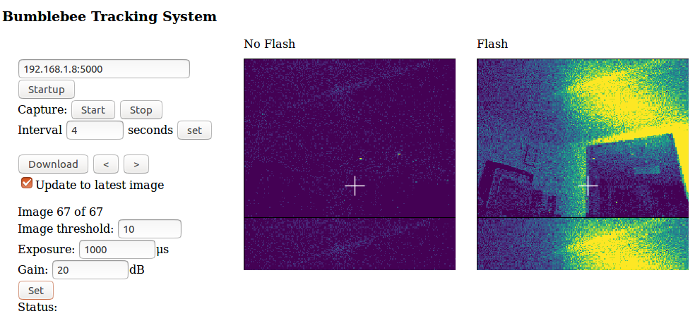

# bee_system
This module includes both the system to run on the flight raspberry pi and a web interface.

A demo of the web interface.

# Install Instructions
1. Download the aravis library:

    cd ~
    git clone https://github.com/AravisProject/aravis.git
    
2. Download this tool

   pip install git+https://github.com/lionfish0/bee_system.git

3. Add the relevant paths to make aravis work:

   export GI_TYPELIB_PATH=$GI_TYPELIB_PATH:~/aravis/src
   export LD_LIBRARY_PATH=~aravis/src/.libs

# System Requirements 

    pip install Flask

# Other notes

I'm trying out <a href="https://howtoraspberrypi.com/create-a-wi-fi-hotspot-in-less-than-10-minutes-with-pi-raspberry/">this site</a> for providing a wifi hotspot. And install <pre>http-server</pre> to host the webserver files.
